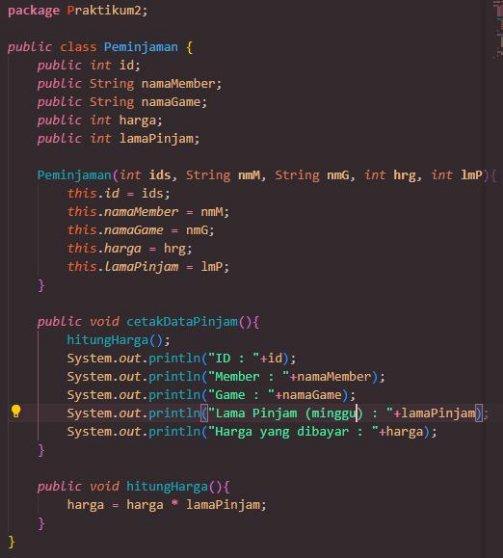
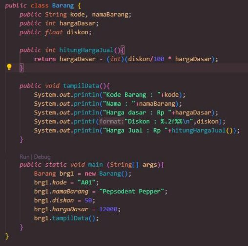

# Praktikum 2 - Class dan Object

NAMA : MUHAMMAD KEMAL NUGRAHA 

NIM! : 2241720044

KELAS : 2-C

ABSEN : 17

---

**Percobaan 1**

**Percobaan 2**

Pertanyaan

1. Jelaskan pada bagian mana proses pendeklarasian atribut pada program diatas! **jawab:**

pada class mahasiswa terdapat pendeklarasian atribut yang bermodifier public dan memberikan tipe data serta nama atribut nya

2. Jelaskan pada bagian mana proses pendeklarasian method pada program diatas! **jawab:**

method dideklarasikan pada class mahasiswa dengan memberi modifier public, bertipe data void (karena tidak akan mengembalikan nilai apapun) dan nama method. Setelah itu baru diberikan statement didalamnya.

3. Berapa banyak objek yang di instansiasi pada program diatas!

**jawab:**

Hanya terdapat 1 objek yang diinstansiasi yaitu objek mhs1

4. Apakah yang sebenarnya dilakukan pada sintaks program “mhs1.nim=101” ? **jawab:**

sintaks tersebut akan memberi nilai nim pada objek mhs1 sebesar 101

5. Apakah yang sebenarnya dilakukan pada sintaks program “mhs1.tampilBiodata()” ? **jawab:**

sintaks tersebut akan menjalankan method tampilBiodata yang terdapat pada class Mahasiswa dengan data dari objek mhs1.

6. Instansiasi 2 objek lagi pada program diatas!

**jawab:**

**Percobaan 3**

1. Apakah fungsi argumen dalam suatu method?

**jawab:**

argumen dalam method berguna apabila dalam aksi method diperlukan inputan nilai

2. Ambil kesimpulan tentang kegunaan dari kata kunci return , dan kapan suatu method harus memiliki return!

**jawab:**

return berguna untuk mengembalikan nilai yang diinginkan, return biasa digunakan apabila method tersebut memiliki tipe data selain void

**Tugas**

1. Suatu toko persewaan video game salah satu yang diolah adalah peminjaman, dimana data yang dicatat ketika ada orang yang melakukan peminjaman adalah id, nama member, nama game, dan harga yang harus dibayar. Setiap peminjaman bisa menampilkan data hasil peminjaman dan harga yang harus dibayar. Buatlah class diagram pada studi kasus diatas!

Penjelasan:

Harga yang harus dibayar diperoleh dari lama sewa x harga.

Diasumsikan 1x transaksi peminjaman game yang dipinjam hanya 1 game saja.

**jawab:**

2. Buatlah program dari class diagram yang sudah anda buat di no 1! **kode program:**

**class Peminjaman**

**class testPeminjaman**

**hasil run:**

3. Buatlah program sesuai dengan class diagram berikut ini:

**kode program:**

**hasil run:**

4. Buatlah program sesuai dengan class diagram berikut ini:

Deskripsi / Penjelasan :

Nilai atribut hargaDasar dalam Rupiah dan atribut diskon dalam %

Method hitungHargaJual() digunakan untuk menghitung harga jual dengan perhitungan berikut ini:

harga jual = harga dasar – (diskon x harga dasar)

Method tampilData() digunakan untuk menampilkan nilai dari kode, namaBarang, hargaDasar, diskon dan harga jual.

**kode program:**

**hasil run:**

