# Praktikum 3 - Enkapsulasi

Nama : Muhammad Kemal Nugraha<br>
NIM : 2241720044<br>
Kelas : 2C<br>
Absen : 17<br>

## 3.1 Percobaan 1

Code:
- class Motor
```java
package motorencapsulation;

public class Motor {
    public int kecepatan = 0;
    public boolean kontakOn = false;

    public void printStatus(){
        if(kontakOn == true){
            System.out.println("Kontak On");
        } else {
            System.out.println("Kontak Off");
        }
        System.out.println("Kecepatan "+kecepatan+"\n");
    }
	
}
```
- class MotorDemo
```java
package motorencapsulation;

public class MotorDemo {
    public static void main(String[] args) {
        Motor motor = new Motor();
        motor.printStatus();
	motor.kecepatan = 50;
	motor.printStatus();
    }
}
```

Run Result:<br>
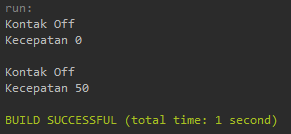

## 3.2 Percobaan 2

Code:
- class Motor
```java
package motorencapsulation;
public class Motor {
    private int kecepatan = 0;
    private boolean kontakOn = false;
    
    public void nyalakanMesin(){
        kontakOn = true;
    }
    public void matikanMesin(){
        kontakOn = false;
        kecepatan = 0;
    }
    public void tambahKecepatan(){
        if (kontakOn == true){
            kecepatan += 5;
        } else {
            System.out.println("Kecepatan tidak bisa bertambah karena mesin off!\n");
        }
    }
    public void kurangiKecepatan(){
        if (kontakOn == true){
            kecepatan -= 5;
        } else {
            System.out.println("Kecepatan tidak bisa berkurang karena mesin off!\n");
        }
    }
    public void printStatus(){
        if(kontakOn == true){
            System.out.println("Kontak On");
        } else {
            System.out.println("Kontak Off");
        }
        System.out.println("Kecepatan "+kecepatan+"\n");
    }
}
```
- class MotorDemo
```java
package motorencapsulation;

public class MotorDemo {
    public static void main(String[] args) {
        Motor motor = new Motor();
        motor.printStatus();
        motor.tambahKecepatan();
        
        motor.nyalakanMesin();
        motor.printStatus();
        
        motor.tambahKecepatan();
        motor.printStatus();
        
        motor.tambahKecepatan();
        motor.printStatus();
        
        motor.tambahKecepatan();
        motor.printStatus();
        
        motor.matikanMesin();
        motor.printStatus();
    }
}
```
Run Result:<br>
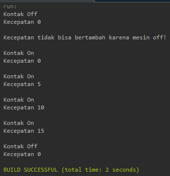

## 3.3 Pertanyaan
1. Pada class MotorDemo, saat kita menambah kecepatan untuk pertama kalinya, mengapa
muncul peringatan “Kecepatan tidak bisa bertambah karena Mesin Off!”? <br>
jawab:<br>
karena saat itu nilai dari kontakOn adalah false yang artinya mesin masih mati
2. Mengapat atribut kecepatan dan kontakOn diset private? <br>
jawab:<br>
agar tidak mudah diubah-ubah dan hanya bisa melalui fungsi setter
3. Ubah class Motor sehingga kecepatan maksimalnya adalah 100!<br>
jawab:<br>
- perubahan code pada class Motor
```java
    public void tambahKecepatan(){
        if (kontakOn == true){
            if (kecepatan < 100){
                kecepatan += 25;
            } else {
                System.out.println("Kecepatan Maksimal 100!");
            }
        } else {
            System.out.println("Kecepatan tidak bisa bertambah karena mesin off!\n");
        }
    }
```
- Run Result:<br>
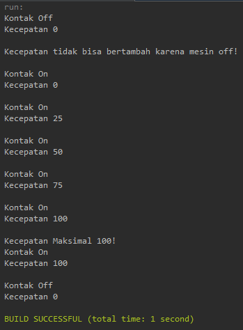

## 3.4 Percobaan 3

Code:
- class Anggota
```java
package percobaan;

public class Anggota {
    private String nama;
    private String alamat;
    private float simpanan;
    
    public void setNama(String nama){
        this.nama = nama;
    }
    public void setAlamat(String alamat){
        this.alamat = alamat;
    }
    public String getNama(){
        return nama;
    }
    public String getAlamat(){
        return alamat;
    }
    public float getSimpanan(){
        return simpanan;
    }
    public void setor(float uang){
        simpanan += uang;
    }
    public void pinjam(float uang){
        simpanan -= uang;
    }
}
```
- class KoperasiDemo
```java
package percobaan;

public class KoperasiDemo {
    public static void main(String[] args) {
        Anggota anggota1 = new Anggota();
        anggota1.setNama("Iwan Setiawan");
        anggota1.setAlamat("Jalan Sukarno Hatta no 10");
        anggota1.setor(100000);
        System.out.println("Simpanan "+anggota1.getNama()+" : Rp "+anggota1.getSimpanan());
        
        anggota1.pinjam(5000);
        System.out.println("Simpanan "+anggota1.getNama()+" : Rp "+anggota1.getSimpanan());
        
    }
}
```
Run Result:<br>
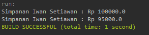

## 3.5 Percobaan 4

Code:
- class Anggota
```java
package percobaan;

public class Anggota {
    private String nama;
    private String alamat;
    private float simpanan;

    public Anggota(String nama, String alamat) {
        this.nama = nama;
        this.alamat = alamat;
        this.simpanan = 0;
    }

    public void setNama(String nama){
        this.nama = nama;
    }
    public void setAlamat(String alamat){
        this.alamat = alamat;
    }
    public String getNama(){
        return nama;
    }
    public String getAlamat(){
        return alamat;
    }
    public float getSimpanan(){
        return simpanan;
    }
    public void setor(float uang){
        simpanan += uang;
    }
    public void pinjam(float uang){
        simpanan -= uang;
    }
}
```
- class KoperasiDemo
```java
package percobaan;

public class KoperasiDemo {
    public static void main(String[] args) {
        Anggota anggota1 = new Anggota("Iwan Setiawan","Jalan Mawar");
        System.out.println("Simpanan "+anggota1.getNama()+" : Rp "+anggota1.getSimpanan());
        
        anggota1.setNama("Iwan Setiawan");
        anggota1.setAlamat("Jalan Sukarno Hatta no 10");
        anggota1.setor(100000);
        System.out.println("Simpanan "+anggota1.getNama()+" : Rp "+anggota1.getSimpanan());
        
        anggota1.pinjam(5000);
        System.out.println("Simpanan "+anggota1.getNama()+" : Rp "+anggota1.getSimpanan());
    }
}
```

Run Result:<br>
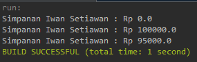

## 3.6 Pertanyaan
1. Apa yang dimaksud getter dan setter?<br>
jawab:<br>
getter adalah sebuah fungsi yang digunakan untuk mengambil nilai dari variabel private dan 
setter adalah fungsi yang digunakan untuk mengubah nilai dari variabel private.
2. Apa kegunaan dari method getSimpanan()?<br>
jawab:<br>
untuk mengambail nilai simpanan terbaru
3. Method apa yang digunakan untk menambah saldo?<br>
jawab:<br>
digunakan method setor()
4. Apa yand dimaksud konstruktor?<br>
jawab:<br>
metode inisialisasi objek yang dapat memiliki parameter dan akan memudahkan dalam pembuatan objek
5. Sebutkan aturan dalam membuat konstruktor?<br>
jawab:<br>
- Nama konstruktor harus sama dengan nama class
- Konstruktor tidak memiliki tipe data return
- Konstruktor tidak boleh menggunakan modifier abstract, static, final, dan syncronized
6. Apakah boleh konstruktor bertipe private?<br>
jawab:<br>
boleh saja
7. Kapan menggunakan parameter dengan passsing parameter?<br>
jawab:<br>
apabila constructor yang dibuat menggunakan parameter
8. Apa perbedaan atribut class dan instansiasi atribut?<br>
jawab:<br>
atribut class adalah variabel yang ada pada class tersebut sedangkan instansiasi adalah metode pembuatan variabel dengan kata kunci new
9. Apa perbedaan class method dan instansiasi method?<br> 
jawab:<br>
class method adalah fungsi yang ada pada class tersebut sedangkan instansiasi method sebenarnya tidak ada karena instansiasi lebih berhubungan pada sebuah objek atau variabel.

## Tugas
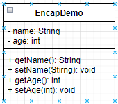<br>
1. Cobalah program dibawah ini dan tuliskan hasil outputnya
Code:
- class EncapDemo
```java
package tugasencap;

public class EncapDemo {
    private String name;
    private int age;
    
    public String getName(){
        return name;
    }
    public void setName(String newName){
        name = newName;
    }
    public int getAge(){
        return age;
    }
    public void setAge(int newAge){
        if(newAge>30){
            age = 30;
        } else {
            age = newAge;
        }
    }
    
}
```
- class EncapTest
```java
package tugasencap;

public class EncapTest {
    public static void main(String[] args) {
        EncapDemo encap = new EncapDemo();
        encap.setName("James");
        encap.setAge(35);
        
        System.out.println("Name: "+encap.getName());
        System.out.println("Age: "+encap.getAge());
    }
}
```
Run Result:<br>
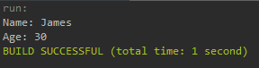
 
2. Pada program diatas, pada class EncapTest kita mengeset age dengan nilai 35, namun pada
saat ditampilkan ke layar nilainya 30, jelaskan mengapa.
jawab:
karena pada method setAge terdapat if dimana jika newAge/ umur inputan lebih dari 30 maka akan ditampilkan 30

3. Ubah program diatas agar atribut age dapat diberi nilai maksimal 30 dan minimal 18.
Perubahan code:
```java
public void setAge(int newAge){
        if(newAge<18){
            age = newAge;
            System.out.println("Minimal umur 18 tahun!\n");
        } else {
            if(newAge>30){
                age = 30;
            } else {
                age = newAge;
            }
        }
    }
```
Run Result:<br>
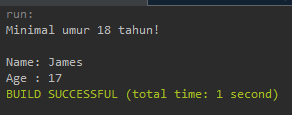
---
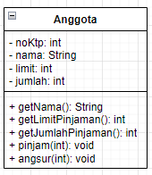<br>
4. Pada sebuah sistem informasi koperasi simpan pinjam, terdapat class Anggota yang memiliki
atribut antara lain nomor KTP, nama, limit peminjaman, dan jumlah pinjaman. Anggota
dapat meminjam uang dengan batas limit peminjaman yang ditentukan. Anggota juga dapat
mengangsur pinjaman. Ketika Anggota tersebut mengangsur pinjaman, maka jumlah
pinjaman akan berkurang sesuai dengan nominal yang diangsur. Buatlah class Anggota
tersebut, berikan atribut, method dan konstruktor sesuai dengan kebutuhan. Uji dengan
TestKoperasi berikut ini untuk memeriksa apakah class Anggota yang anda buat telah sesuai
dengan yang diharapkan.

Code:
- class Anggota
```java
package koperasi;

public class Anggota {
    private String noKtp;
    private String nama;
    private int limit;
    private int jumlah;

    public Anggota(String noKtp, String nama, int limit) {
        this.noKtp = noKtp;
        this.nama = nama;
        this.limit = limit;
        this.jumlah = 0;
    }
    
    public String getNama(){
        return nama;
    }
    public int getLimitPinjaman(){
        return limit;
    }
    public int getJumlahPinjaman(){
        return jumlah;
    }
    public void pinjam(int nominal){
        int temp = jumlah;
        temp += nominal;
        boolean check = temp < limit;
        
        if (check==true){
            jumlah += nominal;
        } else {
            System.out.println("Maaf, jumlah pinjaman melebihi limit");
        }
    }
    public void angsur(int nominal){
        if(jumlah > 0){
            jumlah -= nominal;
        } else {
            System.out.println("Anda tidak punya pinjaman saat ini");
        }
    }
}
```
- class TestKoperasi
```java
package koperasi;

public class TestKoperasi {
    public static void main(String[] args) {
        Anggota donny = new Anggota("111333444", "Donny", 5000000);
        System.out.println("Nama Anggota: "+donny.getNama());
        System.out.println("Limit Pinjaman: "+donny.getLimitPinjaman());
        
        System.out.println("\nMeminjam uang 10.000.000...");
        donny.pinjam(10000000);
        System.out.println("Jumlah pinjaman saat ini: "+donny.getJumlahPinjaman());
        
        System.out.println("\nMeminjam uang 4.000.000...");
        donny.pinjam(4000000);
        System.out.println("Jumlah pinjaman saat ini: "+donny.getJumlahPinjaman());
        
        System.out.println("\nMembayar angsuran 1.000.000...");
        donny.angsur(1000000);
        System.out.println("Jumlah pinjaman saat ini: "+donny.getJumlahPinjaman());
        
        System.out.println("\nMembayar angsuran 3.000.000...");
        donny.angsur(3000000);
        System.out.println("Jumlah pinjaman saat ini: "+donny.getJumlahPinjaman());
    }
}
```
Run Result:<br>
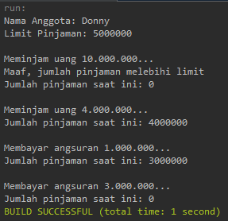

5. Modifikasi soal no. 4 agar nominal yang dapat diangsur minimal adalah 10% dari jumlah
pinjaman saat ini. Jika mengangsur kurang dari itu, maka muncul peringatan “Maaf,
angsuran harus 10% dari jumlah pinjaman”.
Code:
- class Anggota
```java
package koperasi;

public class Anggota {
    private String noKtp;
    private String nama;
    private int limit;
    private int jumlah;

    public Anggota(String noKtp, String nama, int limit) {
        this.noKtp = noKtp;
        this.nama = nama;
        this.limit = limit;
        this.jumlah = 0;
    }
    
    public String getNama(){
        return nama;
    }
    public int getLimitPinjaman(){
        return limit;
    }
    public int getJumlahPinjaman(){
        return jumlah;
    }
    public void pinjam(int nominal){
        int temp = jumlah;
        temp += nominal;
        boolean check = temp < limit;
        
        if (check==true){
            jumlah += nominal;
        } else {
            System.out.println("Maaf, jumlah pinjaman melebihi limit");
        }
    }
    public void angsur(int nominal){
        if(jumlah > 0){
            if(nominal<jumlah/10){
                System.out.println("Maaf, jumlah angsuran harus 10% dari jumlah pinjaman");
            } else {
                jumlah -= nominal;
            }
        } else {
            System.out.println("Anda tidak punya pinjaman saat ini");
        }
    }
}
```
- class TestKoperasi
```java
package koperasi;

public class TestKoperasi {
    public static void main(String[] args) {
        Anggota donny = new Anggota("111333444", "Donny", 5000000);
        System.out.println("Nama Anggota: "+donny.getNama());
        System.out.println("Limit Pinjaman: "+donny.getLimitPinjaman());
        
        System.out.println("\nMeminjam uang 10.000.000...");
        donny.pinjam(10000000);
        System.out.println("Jumlah pinjaman saat ini: "+donny.getJumlahPinjaman());
        
        System.out.println("\nMeminjam uang 4.000.000...");
        donny.pinjam(4000000);
        System.out.println("Jumlah pinjaman saat ini: "+donny.getJumlahPinjaman());
        
        System.out.println("\nMembayar angsuran 1.000.000...");
        donny.angsur(1000000);
        System.out.println("Jumlah pinjaman saat ini: "+donny.getJumlahPinjaman());
        
        System.out.println("\nMembayar angsuran 30.000...");
        donny.angsur(30000);
        System.out.println("Jumlah pinjaman saat ini: "+donny.getJumlahPinjaman());
    }
}
```
Run Result:<br>
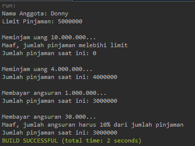

6. Modifikasi class TestKoperasi, agar jumlah pinjaman dan angsuran dapat menerima input
dari console.
Code:
- class Anggota
```java
package koperasi;

public class Anggota {
    private String noKtp;
    private String nama;
    private int limit;
    private int jumlah;

    public Anggota(String noKtp, String nama, int limit) {
        this.noKtp = noKtp;
        this.nama = nama;
        this.limit = limit;
        this.jumlah = 0;
    }
    
    public String getNama(){
        return nama;
    }
    public int getLimitPinjaman(){
        return limit;
    }
    public int getJumlahPinjaman(){
        return jumlah;
    }
    public void pinjam(int nominal){
        int temp = jumlah;
        temp += nominal;
        boolean check = temp <= limit;
        
        if (check==true){
            jumlah += nominal;
            limit -= jumlah;
        } else {
            System.out.println("Maaf, jumlah pinjaman melebihi limit");
        }
    }
    public void angsur(int nominal){
        if(jumlah > 0){
            if(nominal<jumlah/10){
                System.out.println("Maaf, jumlah angsuran harus 10% dari jumlah pinjaman");
            } else {
                jumlah -= nominal;
            }
        } else {
            System.out.println("Anda tidak punya pinjaman saat ini");
        }
    }
}
```
- class TestKoperasi
```java
package koperasi;
import java.util.*;
import javax.accessibility.AccessibleRole;
public class TestKoperasi {
    static void menu(){
        System.out.println("pilih aksi");
        System.out.println("1. Pinjam");
        System.out.println("2. Angsur");
        System.out.println("3. Cek limit");
        System.out.println("0. Keluar");
        System.out.println("=======================");
    }
    public static void main(String[] args) {
        Scanner sc = new Scanner(System.in);
        Anggota donny = new Anggota("111333444", "Donny", 5000000);
        System.out.println("Nama Anggota: "+donny.getNama());
        System.out.println("Limit Pinjaman: "+donny.getLimitPinjaman());
        int exit = 0, input = 0;
        do {
            menu();
            input = sc.nextInt();
            switch (input) {
                case 1:
                    System.out.print("Masukkan nominal: ");
                    input = sc.nextInt();
                    System.out.println("\nMeminjam uang "+input);
                    donny.pinjam(input);
                    System.out.println("Jumlah pinjaman saat ini: "+donny.getJumlahPinjaman());
                    break;
                case 2:
                    System.out.print("Masukkan nominal: ");
                    input = sc.nextInt();
                    System.out.println("\nMembayar angsuran "+input);
                    donny.angsur(input);
                    System.out.println("Jumlah pinjaman saat ini: "+donny.getJumlahPinjaman());
                    break;
                case 3:
                    System.out.println("Limit saat ini Rp "+donny.getLimitPinjaman());
                    break;
                case 0:
                    exit=1;
                    break;
                default:
                    System.out.println("masukan menu yang ada");;
            }
        } while(exit==0);
    }
}
```
Run Result:<br>
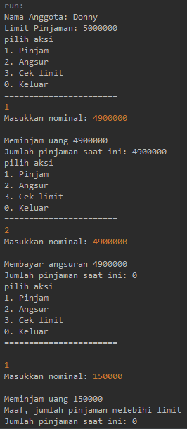<br>
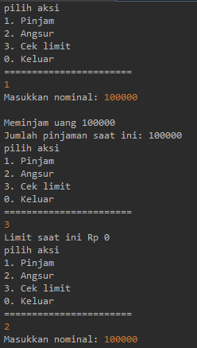<br>
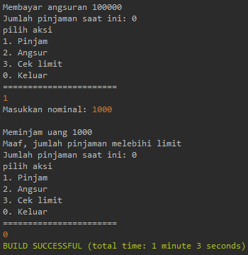<br>
---

