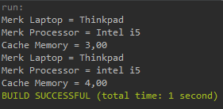
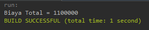
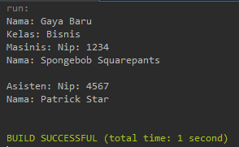
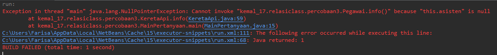
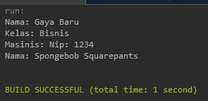
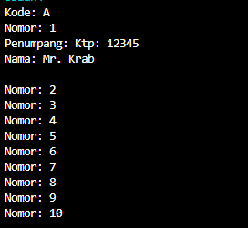
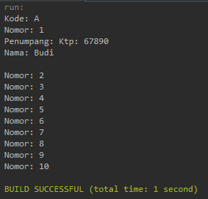
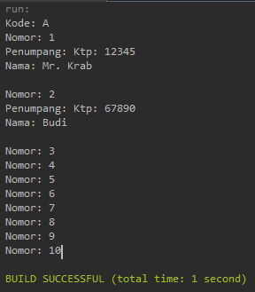
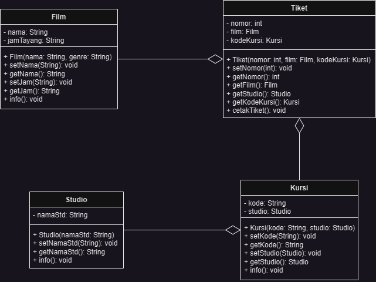
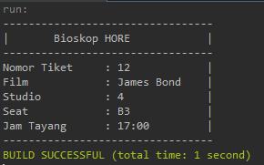

# Praktikum 4 - Relasi CLass

Nama : Muhammad Kemal Nugraha<br>
NIM : 2241720044<br>
Kelas : 2C<br>
Absen : 17<br>

## Percobaan 1

Code:
- class Laptop
```java
package kemal_17.relasiclass.percobaan1;

public class Laptop {
    private String merk;
    private Processor proc;

    public Laptop() {
    }

    public Laptop(String merk, Processor proc) {
        this.merk = merk;
        this.proc = proc;
    }
    public String getMerk(){
        return merk;
    }
    public Processor getProc(){
        return proc;
    }
    public void setMerk (String newMerk){
        merk = newMerk;
    }
    public void setProc (Processor newProc){
        proc = newProc;
    }
    public void info(){
        System.out.println("Merk Laptop = "+merk);
        proc.info();
    }
}
```

- class Processor
```java
package kemal_17.relasiclass.percobaan1;

public class Processor {
    private String merk;
    private double cache;

    Processor() {
    }

    public Processor(String merk, double cache) {
        this.merk = merk;
        this.cache = cache;
    }
    
    public String getMerk(){
        return merk;
    }
    public double getCache(){
        return cache;
    }
    public void setMerk (String newMerk){
        merk = newMerk;
    }
    public void setCache (double newCache){
        cache = newCache;
    }
    public void info(){
        System.out.printf("Merk Processor = %s\n",merk);
        System.out.printf("Cache Memory = %.2f\n",cache);
    }
}
```

- class MainPercobaan1
```java
package kemal_17.relasiclass.percobaan1;

public class MainPercobaan1 {
    public static void main(String[] args) {
        Processor p = new Processor("Intel i5", 3);
        //Laptop l = new Laptop("Thinkpad", p);
        Laptop l = new Laptop("Thinkpad", new Processor("Intel i5", 3));
        l.info();
        
        Processor p1 = new Processor();
        p1.setMerk("intel i5");
        p1.setCache(4);
        Laptop l1 = new Laptop();
        l1.setMerk("Thinkpad");
        l1.setProc(p1);
        l1.info();
    }
}
```
Run Result:<br>


## Pertanyaan Percobaan 1
1. Di dalam class Processor dan class Laptop , terdapat method setter dan getter untuk
masing‑masing atributnya. Apakah gunanya method setter dan getter tersebut ?<br>
Jawab:<br>
Setter berfungsi untuk melakukan perubahan pada variabel yang beridentifier private. Sedangkan Getter berfungsi untuk mengambil nilai dari variabel yang beridentifier private.

2. Di dalam class Processor dan class Laptop, masing‑masing terdapat konstruktor
default dan konstruktor berparameter. Bagaimanakah beda penggunaan dari kedua jenis
konstruktor tersebut ?<br>
Jawab:<br>
Konstruktor default digunakan apabila ingin membuat objek tanpa diisikan atribut didalamnya.
Konstruktor berparameter digunakan apabila ingin membuat objek yang akan diisikan langsung atributnya.

3. Perhatikan class Laptop, di antara 2 atribut yang dimiliki (merk dan proc), atribut
manakah yang bertipe object ?<br>
Jawab:<br>
Proc yang bertipe objek processor. 

4. Perhatikan class Laptop, pada baris manakah yang menunjukan bahwa class Laptop
memiliki relasi dengan class Processor ?<br>
Jawab:<br>
```
private Processor proc;
```

5. Perhatikan pada class Laptop , Apakah guna dari sintaks proc.info() ?<br>
Jawab:<br>
Untuk menampilkan info dari merk laptop dan dan juga info dari processor itu seperti merk processor dan cache.

6. Pada class MainPercobaan1, terdapat baris kode:
Laptop l = new Laptop("Thinkpad", p);.
Apakah p tersebut ?<br>
Jawab:<br>
P tersebut adalah nama objek yang sudah diinstansiasi dari class processor.

- Dan apakah yang terjadi jika baris kode tersebut diubah menjadi:
Laptop l = new Laptop("Thinkpad", new Processor("Intel i5", 3));
Bagaimanakah hasil program saat dijalankan, apakah ada perubahan ?<br>
Jawab:<br>
Tidak ada perubahan sama saja.

## Percobaan 2

Code:
- class Mobil
```java
package kemal_17.relasiclass.percobaan2;

public class Mobil {
    private String merk;
    private int biaya;

    public Mobil() {
    }
    public String getMerk(){
        return merk;
    }
    public int getBiaya(){
        return biaya;
    }
    public void setMerk(String newMerk){
        merk = newMerk;
    }
    public void setBiaya(int newBiaya){
        biaya = newBiaya;
    }
    public int hitungBiayaMobil (int hari){
        return biaya * hari;
    }
}
```

- class Sopir
```java
package kemal_17.relasiclass.percobaan2;

public class Sopir {
    private String nama;
    private int biaya;

    public Sopir() {
    }
    public void setNama(String newNama){
        nama = newNama;
    }
    public void setBiaya(int newBiaya){
        biaya = newBiaya;
    }
    public int hitungBiayaSopir(int hari){
        return biaya * hari;
    }
}
```

- class Pelanggan
```java
package kemal_17.relasiclass.percobaan2;

public class Pelanggan {
    private String nama;
    private Mobil mobil;
    private Sopir sopir;
    private int hari;
    
    public Pelanggan() {
    }
    
    public String getNama(){
        return nama;
    }
    public Mobil getMobil(){
        return mobil;
    }
    public Sopir getSopir(){
        return sopir;
    }
    public int getHari(){
        return hari;
    }
    public void setNama(String newNama){
        nama = newNama;
    }
    public void setMobil(Mobil newMobil){
        mobil = newMobil;
    }
    public void setSopir(Sopir newSopir){
        sopir = newSopir;
    }
    public void setHari(int newHari){
        hari = newHari;
    }
    
    public int hitungBiayaTotal(){
        return mobil.hitungBiayaMobil(hari)+
        sopir.hitungBiayaSopir(hari);
    }
}

```

- class MainPercobaan2
```java
package kemal_17.relasiclass.percobaan2;

public class MainPercobaan2 {
    public static void main(String[] args) {
        Mobil m = new Mobil();
        m.setMerk("Avanza");
        m.setBiaya(350000);
        Sopir s = new Sopir();
        s.setNama("John Doe");
        s.setBiaya(200000);
        Pelanggan p = new Pelanggan();
        p.setNama("Jane Doe");
        p.setMobil(m);
        p.setSopir(s);
        p.setHari(2);
        System.out.println("Biaya Total = " +
        p.hitungBiayaTotal());
        System.out.println(p.getMobil().getMerk());
    }
}

```

Run Result:<br>


# Pertanyaan Percobaan 2

1. Perhatikan class Pelanggan. Pada baris program manakah yang menunjukan bahwa class
Pelanggan memiliki relasi dengan class Mobil dan class Sopir ?<br>
Jawab:<br>
```
private Mobil mobil;
private Sopir sopir;
```

2. Perhatikan method hitungBiayaSopir pada class Sopir, serta method
hitungBiayaMobil pada class Mobil. Mengapa menurut Anda method tersebut harus
memiliki argument hari ?<br>
Jawab:<br>
Karena secara logika biaya akan dihitung dengan akumulasi lama bekerjanya bukan dihitung perharinya.

3. Perhatikan kode dari class Pelanggan. Untuk apakah perintah
mobil.hitungBiayaMobil(hari) dan sopir.hitungBiayaSopir(hari) ?<br>
Jawab:<br>
Kedua perintah itu digunakan untuk menghitung biaya yang dikeluarkan oleh mobil dan sopir. Serta pada akhirnya keduanya akan ditotal.

4. Perhatikan class MainPercobaan2. Untuk apakah sintaks p.setMobil(m) dan
p.setSopir(s) ?<br>
Jawab:<br>
Untuk memberikan nilai pada variabel mobil dan sopir dari class pelanggan yaitu objek m dari mobil dan objek s dari sopir.

5. Perhatikan class MainPercobaan2. Untuk apakah proses p.hitungBiayaTotal()
tersebut ?<br>
Jawab:<br>
Untuk menghitung total biaya yang dikeluarkan pelanggan yang berasal dari akumulasi biaya Mobil dan biaya Sopir.

6. Perhatikan class MainPercobaan2, coba tambahkan pada baris terakhir dari method
main dan amati perubahan saat di‑run!
System.out.println(p.getMobil().getMerk());<br>
Jadi untuk apakah sintaks p.getMobil().getMerk() yang ada di dalam method
main tersebut?<br>
Jawab:<br>
p adalah objek pelanggan yang memanggil getMobil() yang akan memanggil objek m dan objek m akan memanggil getMerk() untuk memberikan nilai merk pada objek m yaitu avanza.

## Percobaan 3

Code:
- class KeretaApi
```java
package kemal_17.relasiclass.percobaan3;

public class KeretaApi {
    private String nama;
    private String kelas;
    private Pegawai masinis;
    private Pegawai asisten;

    public KeretaApi(String nama, String kelas, Pegawai masinis) {
        this.nama = nama;
        this.kelas = kelas;
        this.masinis = masinis;
    }
    public KeretaApi(String nama, String kelas, Pegawai masinis, Pegawai asisten) {
        this.nama = nama;
        this.kelas = kelas;
        this.masinis = masinis;
        this.asisten = asisten;
    }
    
    public String getNama(){
        return nama;
    }
    public String getKelas(){
        return kelas;
    }
    public Pegawai getMasinis(){
        return masinis;
    }
    public Pegawai getAsisten(){
        return asisten;
    }
    public void setNama(String newNama){
        nama = newNama;
    }
    public void setKelas(String newKelas){
        kelas = newKelas;
    }
    public void setMasinis(Pegawai newMasinis){
        masinis = newMasinis;
    }
    public void setAsisten(Pegawai newAsisten){
        asisten = newAsisten;
    }
    
    public String info(){
        String info = "";
        info += "Nama: " + this.nama + "\n";
        info += "Kelas: " + this.kelas + "\n";
        info += "Masinis: " + this.masinis.info() + "\n";
        info += "Asisten: " + this.asisten.info() + "\n";
        return info;
    }
}
```

- class Pegawai
```java
package kemal_17.relasiclass.percobaan3;

public class Pegawai {
    private String nip;
    private String nama;

    public Pegawai(String nip, String nama) {
        this.nip = nip;
        this.nama = nama;
    }
    
    public String getNip(){
        return nip;
    }
    public String getNama(){
        return nama;
    }
    public void setNip(String newNip){
        nip = newNip;
    }
    public void setNama(String newNama){
        nama = newNama;
    }
    public String info(){
        String info = "";
        info += "Nip: " + this.nip + "\n";
        info += "Nama: " + this.nama + "\n";
        return info;
    }
}
```

- class MainPercobaan3
```java
package kemal_17.relasiclass.percobaan3;

public class MainPercobaan3 {
    public static void main(String[] args) {
        Pegawai masinis = new Pegawai("1234", "Spongebob Squarepants");
        Pegawai asisten = new Pegawai("4567", "Patrick Star");
        KeretaApi keretaApi = new KeretaApi("Gaya Baru", "Bisnis", 
            masinis, asisten);
        System.out.println(keretaApi.info());
    }
}
```
Run Result:<br>


## Pertanyaan Percobaan 3

1. Di dalam method info() pada class KeretaApi, baris this.masinis.info() dan
this.asisten.info() digunakan untuk apa ?<br>
Jawab:<br>
Untuk melakukan pemanggilan method info() dari objek masinis dan asisten yang akan mencetak informasi seperti nim dan nama.

2. Buatlah main program baru dengan nama class MainPertanyaan pada package yang
sama. Tambahkan kode berikut pada method main() !<br>
Pegawai masinis = new Pegawai("1234", "Spongebob
Squarepants");<br>
KeretaApi keretaApi = new KeretaApi("Gaya Baru", "Bisnis",
masinis);<br>
System.out.println(keretaApi.info());<br>
jawab:<br>
- class MainPertanyaan
```java
package kemal_17.relasiclass.percobaan3;

public class MainPertanyaan {
    public static void main(String[] args) {
        Pegawai masinis = new Pegawai("1234", "Spongebob Squarepants");
        KeretaApi keretaApi = new KeretaApi("Gaya Baru", "Bisnis", masinis);
        System.out.println(keretaApi.info());
    }
}
```

3. Apa hasil output dari main program tersebut ? Mengapa hal tersebut dapat terjadi ?<br>
Jawab:<br>
Run Result:<br>
<br>
Hal itu bisa terjadi karena pada method info pada class KeretaApi terdapat this.asisten untuk mencetak isi dari variabel asisten sedangkan pada objek keretaApi asisten tidak menjadi bagian dari atribut objeknya. 

4. Perbaiki class KeretaApi sehingga program dapat berjalan !<br>
jawab:<br>
- class MainPertanyaan
```java
package kemal_17.relasiclass.percobaan3;

public class MainPertanyaan {
    public static void main(String[] args) {
        Pegawai masinis = new Pegawai("1234", "Spongebob Squarepants");
        KeretaApi keretaApi = new KeretaApi("Gaya Baru", "Bisnis", masinis);
        System.out.println(keretaApi.info2());
    }
}
```
- tambahan pada class KeretaApi
```java
public String info2(){
        String info = "";
        info += "Nama: " + this.nama + "\n";
        info += "Kelas: " + this.kelas + "\n";
        info += "Masinis: " + this.masinis.info() + "\n";
        return info;
    }
```
Run Result:<br>


## Percobaan

Code:
- class Gerbong
```java
package kemal_17.relasiclass.percobaan4;

public class Gerbong {
    private String kode;
    private Kursi[] arrayKursi;
    
    public Gerbong(String kode, int jumlah) {
        this.kode = kode;
        this.arrayKursi = new Kursi[jumlah];
        this.initKursi();
    }

    private void initKursi() {
        for (int i = 0; i < arrayKursi.length; i++) {
        this.arrayKursi[i] = new Kursi(String.valueOf(i + 1));
        }
    }
    
    public String getKode(){
        return kode;
    }
    public void setKode(String newKode){
        kode = newKode;
    }
    public Kursi[] getArrayKursi(){
        return arrayKursi;
    }
    public void setPenumpang(Penumpang penumpang, int nomor) {
        this.arrayKursi[nomor - 1].setPenumpang(penumpang);
    }

    public String info() {
        String info = "";
        info += "Kode: " + kode + "\n";
        for (Kursi kursi : arrayKursi) {
            info += kursi.info();
        }
        return info;
    }
}
```

- class Kursi
```java
package kemal_17.relasiclass.percobaan4;

public class Kursi {
    private String nomor;
    private Penumpang penumpang;

    public Kursi(String nomor) {
        this.nomor = nomor;
    }
    
    public String getNomor(){
        return nomor;
    }
    public Penumpang getPenumpang(){
        return penumpang;
    }
    public void setNomor(String newNomor){
        nomor = newNomor;
    }
    public void setPenumpang(Penumpang newPenumpang){
        penumpang = newPenumpang;
    }
    
    public String info() {
        String info = "";
        info += "Nomor: " + nomor + "\n";
        if (this.penumpang != null) {
            info += "Penumpang: " + penumpang.info() + "\n";
        }
        return info;
    }
}
```

- class Penumpang
```java
package kemal_17.relasiclass.percobaan4;

public class Penumpang {
    private String ktp;
    private String nama;

    public Penumpang(String ktp, String nama) {
        this.ktp = ktp;
        this.nama = nama;
    }
    
    public String getKtp(){
        return ktp;
    }
    public String getNama(){
        return nama;
    }
    public void setKtp(String newKtp){
        ktp = newKtp;
    }
    public void setNama(String newNama){
        nama = newNama;
    }
    
    public String info() {
        String info = "";
        info += "Ktp: " + ktp + "\n";
        info += "Nama: " + nama + "\n";
        return info;
    }
}
```

- class MainPercobaan4
```java
package kemal_17.relasiclass.percobaan4;

public class MainPercobaan4 {
    public static void main(String[] args) {
        Penumpang p = new Penumpang("12345", "Mr. Krab");
        Gerbong gerbong = new Gerbong("A", 10);
        gerbong.setPenumpang(p, 1);
        System.out.println(gerbong.info());
    }
}
```
Run Result:<br>


## Pertanyaan Percobaan 4
1. Pada main program dalam class MainPercobaan4, berapakah jumlah kursi dalam
Gerbong A ?<br>
Jawab:<br>
Terdapat 10 kursi

2. Perhatikan potongan kode pada method info() dalam class Kursi. Apa maksud kode
tersebut ?<br>
...
if (this.penumpang != null) {
info += "Penumpang: " + penumpang.info() + "\n";
}
…<br>
Jawab:<br>
Apabila atribut penumpang masih ada objeknya maka akan dicetak rincian infonya seperti ktp dan nama.

3. Mengapa pada method setPenumpang() dalam class Gerbong, nilai nomor dikurangi
dengan angka 1 ?<br>
Jawab:<br>
Karena array dimulai dari indeks nol sedangkan nomor dari 1.
4. Instansiasi objek baru budi dengan tipe Penumpang, kemudian masukkan objek baru
tersebut pada gerbong dengan gerbong.setPenumpang(budi, 1). Apakah yang terjadi ?<br>
Jawab:<br>
Run Result:<br>

5. Modifikasi program sehingga tidak diperkenankan untuk menduduki kursi yang sudah ada
penumpang lain !<br>
Jawab:<br>
- perubahan class PercobaanMain4
```java
package kemal_17.relasiclass.percobaan4;

public class MainPercobaan4 {
    public static void main(String[] args) {
        Penumpang p = new Penumpang("12345", "Mr. Krab");
        Gerbong gerbong = new Gerbong("A", 10);
        gerbong.setPenumpang(p, 1);
        
        //pertanyaan no 5
        Penumpang budi = new Penumpang("67890", "Budi");
        gerbong.setPenumpang(budi, 2);
        
        System.out.println(gerbong.info());
    }
}
```
Run Result:<br>


## Tugas

UML<br>
<br>
Code:
- class Tiket
```java
package kemal_17.relasiclass.tugas;

public class Tiket {
    private int nomor;
    private Film film;
    private Kursi kursi;

    public Tiket(int nomor, Film film, Kursi kursi) {
        this.nomor = nomor;
        this.film = film;
        this.kursi = kursi;
    }
    
    public void setNomor(int newNomor){
        this.nomor = newNomor;
    }
    public int getNomor(){
        return nomor;
    }
    public Film getFilm(){
        return film;
    }
    public Studio getStudio(){
        return kursi.getStudio();
    }
    public Kursi getKursi(){
        return kursi;
    }
    public void cetakTiket(){
        System.out.println("---------------------------------");
        System.out.println("|\tBioskop HORE\t\t|");
        System.out.println("---------------------------------");
        System.out.println("Nomor Tiket\t: "+nomor+"\t\t|");
        System.out.println("Film\t\t: "+film.getNama()+"\t|");
        System.out.println("Studio\t\t: "+getStudio().getNamaStd()+"\t\t|");
        System.out.println("Seat\t\t: "+kursi.getKode()+"\t\t|");
        System.out.println("Jam Tayang\t: "+film.getJam()+"\t\t|");
        System.out.println("---------------------------------");
    }
}
```
- class Film
```java
package kemal_17.relasiclass.tugas;

public class Film {
    private String nama;
    private String jamTayang;

    public Film(String nama, String jamTayang) {
        this.nama = nama;
        this.jamTayang = jamTayang;
    }
    
    public void setNama(String newNama){
        this.nama = newNama;
    }
    public String getNama(){
        return nama;
    }
    public void setJam(String newJam){
        this.jamTayang = newJam;
    }
    public String getJam(){
        return jamTayang;
    }
    public void info(){
        System.out.println("Film: "+nama);
        System.out.println("Jam Tayang: "+jamTayang);
    }
}
```
- class Studio
```java
package kemal_17.relasiclass.tugas;

public class Studio {
    private String namaStd;

    public Studio(String namaStd) {
        this.namaStd = namaStd;
    }
    
    public void setNamaStd(String newNama){
        this.namaStd = newNama;
    }
    public String getNamaStd(){
        return namaStd;
    }
    public void info(){
        System.out.println("Studio: "+namaStd);
    }
}
```
- class Kursi
```java
package kemal_17.relasiclass.tugas;

public class Kursi {
    private String kode;
    private Studio studio;

    public Kursi(String kode, Studio studio) {
        this.kode = kode;
        this.studio = studio;
    }
    
    public void setKode(String newKode){
        this.kode = newKode;
    }
    public String getKode(){
        return kode;
    }
    public void setStudio(Studio newStudio){
        this.studio = newStudio;
    }
    public Studio getStudio(){
        return studio;
    }
    public void info(){
        System.out.println("Studio: "+studio.getNamaStd());
        System.out.println("kode kursi: "+kode);
    }
}
```
- class MainBioskop
```java
package kemal_17.relasiclass.tugas;

public class MainBioskop {
    public static void main(String[] args) {
        Film f = new Film("James Bond", "17:00");
        Studio s = new Studio("4");
        Kursi k = new Kursi("B3", s);
        Tiket tiket = new Tiket(12, f, k); 
        
        tiket.cetakTiket();
    }
}
```

Run Result:<br>

