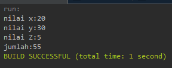
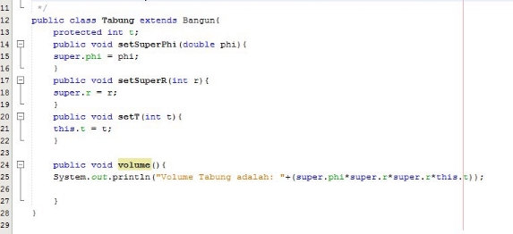
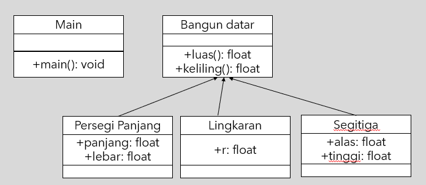
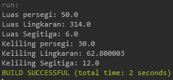
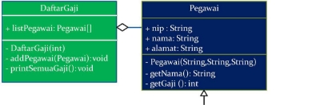

# JOBSHEET 6 

INHERITANCE (PEWARISAN)

Nama : Muhammad Kemal Nugraha<br>
Kelas/ Absen : 2C/ 17<br>
NIM : 2241720044<br>

1\. KOMPETENSI 

1. Memahami konsep dasar inheritance atau pewarisan.
1. Mampu membuat suatu subclass dari suatu superclass tertentu.

2\. PENDAHULUAN 

Inheritance atau pewarisan sifat merupakan suatu cara untuk menurunkan suatu class yang lebih umum menjadi suatu class yang lebih spesifik. Inheritance adalah salah satu ciri utama suatu bahasa program yang berorientasi pada objek. Inti dari pewarisan adalah sifat reusable dari konsep object oriented. Setiap  subclass  akan “mewarisi” sifat dari  superclass  selama bersifat protected ataupun public.

Dalam  inheritance  terdapat  dua  istilah  yang  sering  digunakan.  Kelas  yang  menurunkan disebut kelas dasar (base class/super class), sedangkan kelas yang diturunkan disebut kelas turunan (derived  class/sub  class/child  class)  .  Di  dalam  Java  untuk  mendeklarasikan  suatu  class  sebagai subclass dilakukan dengan cara menambahkan kata kunci  extends  setelah deklarasi nama class, kemudian diikuti dengan nama parent class---nya. Kata kunci extends tersebut memberitahu kompiler Java bahwa kita ingin melakukan perluasan class. Berikut adalah contoh deklarasi inheritance.

public class B extends A {

...

} 

Contoh  diatas  memberitahukan  kompiler  Java  bahwa  kita  ingin  meng---extend  class  A  ke  class  B. 

Dengan kata lain, class B adalah subclass (class turunan) dari class A, sedangkan class A adalah parent class dari class B.

Karakteristik  pada  super  class  akan  dimiliki  juga  oleh  subclassnya.  Terdapat  3  bentuk pewarisan: single inheritance, multilevel inheritance, dan multiple inheritance. Namun yang akan dibahas pada jobsheet ini adalah single inheritance dan multilevel inheritance.

1. Single Inheritance

Single inheritance adalah Suatu class yang hanya mempunyai satu parent class. Contoh:


Gambar 1. Contoh Single Inheritance

Berdasarkan Gambar 1 dapat diketahui bahwa class B merupakan subclass yang mempunyai satu parent yaitu class A sehingga disebut single inheritance.

2. Multilevel Inheritance

Multilevel inheritance adalah Suatu subclass bisa menjadi superclass bagi class yang lain. Contoh:


Gambar 2. Contoh Multilevel Inheritance

Berdasarkan Gambar 2 diatas dapat dilihat bahwa class B merupakan subclass dari class A, sehingga dalam hal ini class A adalah superclass dan class B adalah subclass. Kemudian class B yang awalmya merupakan subclass mempunyai subclass lagi yaitu class C sehingga class B menjadi superclass dari class C, begitu juga seterunya jika class C memilki subclass lagi.

Pada class diagram, pewarisan digambarkan dengan sebuah garis tegas, dengan segitiga di ujungnya. Class yang dekat pada segitiga merupakan superclass, sedangkan class yang jauh dari segitiga  merupakan  subclass. Untuk membentuk sebuah  subclass, keyword  “extends”  digunakan (lihat contoh pada sesi “Implementasi Pewarisan”). Berikut ini adalah contoh class diagram dari pewarisan:


Gambar 3 Contoh class diagram dalam inheritance

Suatu  parent  class  dapat  tidak  mewariskan  sebagian  member ---nya  kepada  subclass---nya. Sejauh mana suatu member dapat diwariskan ke  class  lain,  ataupun  suatu  member  dapat  diakses  dari class lain, sangat  berhubungan dengan  access control (kontrol  pengaksesan).   Di  dalam  java,  kontrol pengaksesan dapat digambarkan dalam tabel berikut  ini: 


Kata kunci super dipakai untuk merujuk pada member dari parent class. Sebagaimana kata kunci this yang dipakai untuk merujuk pada member dari class itu sendiri. Format penulisannya adalah sebagai berikut:

- super.namaAtribut Merujuk/mengakses atribut dari parent class /superclass
- super.namaMethod() Merujuk/memanggil method dari parent class /superclass
- super() Merujuk / memanggil konstruktor parent class /superclass Hanya bisa digunakan dibaris pertama dalam kontruktor.
- super(parameter1, parameter2,dst)

Merujuk / memanggil konstruktor berparamter dari superklas

Ketika mmebuat objek dari subclass, pada saat itu juga objek pada superclass juga akan terbentuk. Dengan katalain, ketika kontruktor subclass dijalankan untuk membuat objek, saat itu juga kontruktor superclass akan berjalan. Jadi di setiap konstruktor subclass, pada baris pertama konstruktor subclass tersebut akan dipanggil konstruktor superclass. Sebelum subclass menjalankan kontruktornya sendiri, subclass akan menjalankan kontruktor superclass terlebih dahulu.

 ## PERCOBAAN 1 (extends) 
 TAHAPAN PERCOBAAN 
1. Buatlah sebuah class parent/superclass dengan nama ClassA.java


2. Buatlah sebuah class anak/subclass dengan nama ClassB.java


3. Buatlah class Percobaan1.java untuk menjalankan program diatas!


4. Jalankan program diatas, kemudian amati apa yang terjadi!

## PERTANYAAN

1. Pada percobaan 1 diatas program yang dijalankan terjadi error, kemudian perbaiki sehingga program tersebut bisa dijalankan dan tidak error!
<br>jawab:<br>
hanya dengan menambahkan keyword extends ClassA<br>
```java
package percobaan1;

public class ClassB extends ClassA{
    public int z;
    
    public void getNilaiZ(){
        System.out.println("nilai z:"+z);
    }
    public void getJumlah(){
        System.out.println("Jumlah:"+(x+y+z));
    }
}
```
hasil<br>
<br>

2. Jelaskan apa penyebab program pada percobaan 1 ketika dijalankan terdapat error!
<br>jawab:<br>
karena classB belum menjalin hubungan inheritance dengan classA. Oleh karena classB tidak mengakses variabel x dan y serta method getNilai dari classA.

## PERCOBAAN 2 (Hak Akses) 

TAHAPAN PERCOBAAN 
1. Buatlah sebuah class parent/superclass dengan nama ClassA.java


2. Buatlah sebuah class anak/subclass dengan nama ClassB.java


3. Buatlah class Percobaan2.java untuk menjalankan program diatas!


4. Jalankan program diatas, kemudian amati apa yang terjadi!

## PERTANYAAN 

1. Pada percobaan 2 diatas program yang dijalankan terjadi error, kemudian perbaiki sehingga program tersebut bisa dijalankan dan tidak error! 
<br>jawab:<br>

kode:
```java
public int getX(){
        return x;
    }
public int getY(){
        return y;
    }
```
dan merubah method getJumlah()
```java
public void getJumlah(){
        System.out.println("jumlah:"+(super.getX()+super.getY()+this.z));
    }
```
<br>

2. Jelaskan apa penyebab program pada percobaan 1 ketika dijalankan terdapat error! 
<br>jawab:<br>
karena x dan y pada classA adalah variabel private, maka classB tidak dapat mengakses secara langsung meskipun sudah menjadi inheritance. Cara untuk mengambil nilainya adalah dengan menggunakan method get.

## PERCOBAAN 3 (Super) 

TAHAPAN PERCOBAAN 
1. Buatlah sebuah class parent/superclass dengan nama Bangun.java


2. Buatlah sebuah class anak/subclass dengan nama Tabung.java



3. Buatlah class Percobaan3.java untuk menjalankan program diatas!


4. Jalankan program diatas!


## PERTANYAAN 

1. Jelaskan fungsi “super” pada potongan program berikut di class Tabung!


<br>jawab:<br>
super disana adalah kata lain dari pemanggilan parent yang akan memberikan akses ke parent. misal super.phi artinya pada class tabung dapat mengakses dan merubah nilai pada phi di class bangun.<br>

2. Jelaskan fungsi “super” dan “this” pada potongan program berikut di class Tabung!


<br>jawab:<br>
super disana untuk mengambil nilai phi dan r yang ter-protected pada class bangun untuk dilakukan operasi. Dan this digunakan untuk mengambil nilai variabel t, karena variabel t memang variabel native class tabung.<br>

3. Jelaskan mengapa pada class Tabung tidak dideklarasikan atribut “phi” dan “r” tetapi class tersebut dapat mengakses atribut tersebut! 
<br>jawab:<br>
karena sudah terhubung sebagai inheritance dengan class bangun menggunakan keyword extends

## PERCOBAAN 4 (super contsructor) 

TAHAPAN PERCOBAAN 
1. Buatlah tiga file dengan nama ClassA.java , ClassB.java , dan ClassC.java, seperti pada kode program dibawah ini!

ClassA.java


ClassB.java


ClassC.java


2. Buatlah class Percobaan4.java untuk menjalankan program diatas!


3. Jalankan program kemudian amati apa yang terjadi!


## PERTANYAAN 
1. Pada percobaan 4 sebutkan mana class yang termasuk superclass dan subclass, kemudian jelaskan alasannya!
<br>jawab:<br>
- dalam hubungan classA dan classB, classA adalah superclass dan classB adalah subclass karena terdapat keyword extends pada classB yang menuju classA
- dalam hubungan classB dan classC, classB adalah superclass dan classC adalah subclass karena terdapat keyword extends pada classC yang menuju classB 

2. Ubahlah isi konstruktor default ClassC seperti berikut:

![ref1]

Tambahkan kata super() di baris Pertaman dalam konstruktor defaultnya. Coba jalankan kembali class Percobaan4 dan terlihat tidak ada perbedaan dari hasil outputnya!

3. Ublah isi konstruktor default ClassC seperti berikut:


Ketika mengubah posisi super() dibaris kedua dalam kontruktor defaultnya dan terlihat ada error. Kemudian kembalikan super() kebaris pertama seperti sebelumnya, maka errornya akan hilang.

Perhatikan hasil keluaran ketika class Percobaan4 dijalankan. Kenapa bisa tampil output seperti berikut pada saat instansiasi objek test dari class ClassC


Jelaskan bagaimana urutan proses jalannya konstruktor saat objek test dibuat! 
<br>jawab:<br>
karena pada setiap class itu memanggil dirinya sendiri dan terdapat keterkaitan inheritance maka semua class akan dijalankan dan ditampilkan bersama.<br>

4. Apakah fungsi super() pada potongan program dibawah ini di ClassC!

![ref2]
<br>jawab:<br>
tidak ada fungsi khusus, malah sama saja bila tidak menggunakannya.

## TUGAS TEORI

Tuliskan program yang berfungsi untuk menghitung luas dan keliling bangun datar



kode:<br>
class bangunDatar
```java
package tugasteori;

import java.util.*;
public class BangunDatar {
    
    public BangunDatar() {
    }
    //public float phi = 3.14;
    
    public float luasPersegi (PersegiPanjang p){
        float panjang = p.getPanjang();
        float lebar = p.getLebar();
        
        return panjang * lebar;
    }
    public float luasLingkaran (Lingkaran l){
        float r = l.getR();
        
        return 3.14f * r * r;
    }
    public float luasSegitiga (Segitiga s){
        float alas = s.getAlas();
        float tinggi = s.getTinggi();
        
        return 0.5f * alas * tinggi;
    }
    
    public float kelilingPersegi (PersegiPanjang p){
        float panjang = p.getPanjang();
        float lebar = p.getLebar();
        
        return 2 * (panjang + lebar);
    }
    public float kelilingLingkaran (Lingkaran l){
        float r = l.getR();
        
        return 2 * 3.14f * r;
    }
    public float kelilingSegitiga (Segitiga s){
        float alas = s.getAlas();
        float tinggi = s.getTinggi();
        float sisMiring = (float) Math.sqrt(alas * alas + tinggi * tinggi);

        return alas + tinggi + sisMiring;
    }
}
```
class persegiPanjang
```java
package tugasteori;

public class PersegiPanjang extends BangunDatar{
    public float panjang;
    public float lebar;

    public PersegiPanjang(float panjang, float lebar) {
        super();
        this.panjang = panjang;
        this.lebar = lebar;
    }
    
    public float getPanjang(){
        return panjang;
    }
    public float getLebar(){
        return lebar;
    }
}
```
class lingkaran
```java
package tugasteori;

public class Lingkaran extends BangunDatar{
    public float r;

    public Lingkaran(float r) {
        super();
        this.r = r;
    }
    
    public float getR(){
        return r;
    }
}
```
class segitiga
```java
package tugasteori;

public class Segitiga extends BangunDatar{
    public float alas;
    public float tinggi;

    public Segitiga(float alas, float tinggi) {
        super();
        this.alas = alas;
        this.tinggi = tinggi;
    }
    
    public float getAlas(){
        return alas;
    }
    public float getTinggi(){
        return tinggi;
    }
}
```
class main
```java
package tugasteori;

public class MainBangunDatar {
    public static void main(String[] args) {
        BangunDatar b = new BangunDatar();
        PersegiPanjang p = new PersegiPanjang(10, 5);
        Lingkaran l = new Lingkaran(10);
        Segitiga s = new Segitiga(4, 3);
        
        System.out.println("Luas persegi: "+b.luasPersegi(p));
        System.out.println("Luas Lingkaran: "+b.luasLingkaran(l));
        System.out.println("Luas Segitiga: "+b.luasSegitiga(s));
        System.out.println("Keliling persegi: "+b.kelilingPersegi(p));
        System.out.println("Keliling Lingkaran: "+b.kelilingLingkaran(l));
        System.out.println("Keliling Segitiga: "+b.kelilingSegitiga(s));
    }
}
```
<br>
hasil



## TUGAS 

1\.  Buatlah sebuah program dengan konsep pewarisan seperti pada class diagram berikut ini. Kemudian buatlah instansiasi objek untuk menampilkan data nama pegawai dan gaji yang didapatkannya.




[ref1]: img/Aspose.Words.c4416e69-b358-41d1-9784-bb036759836a.023.png
[ref2]: img/Aspose.Words.c4416e69-b358-41d1-9784-bb036759836a.026.png
<br>jawab:<br>


