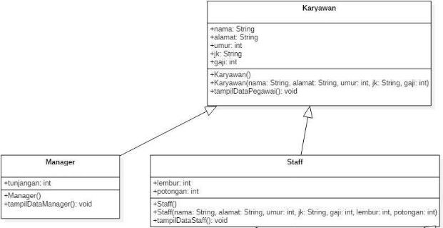
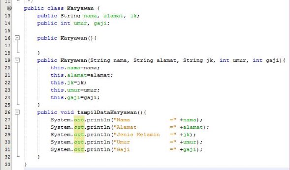
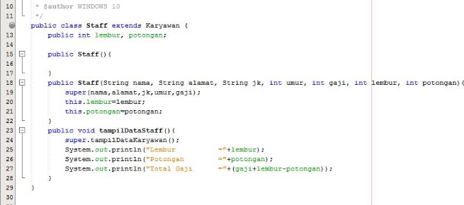
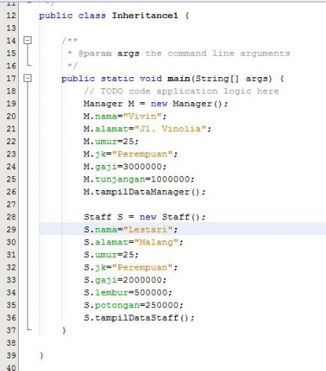
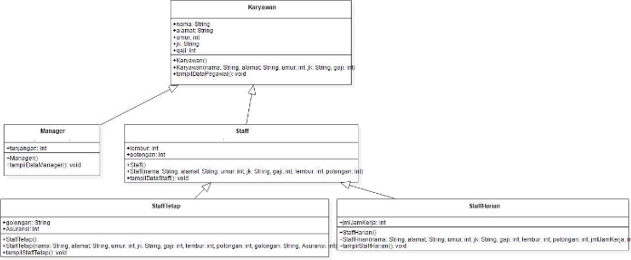
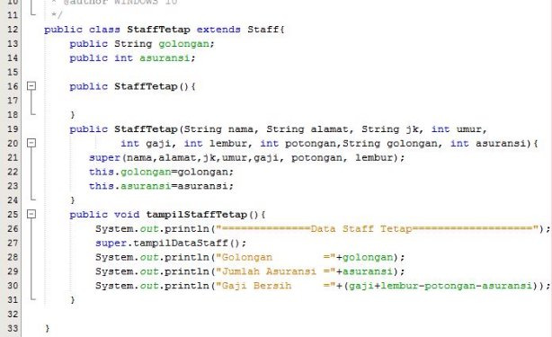
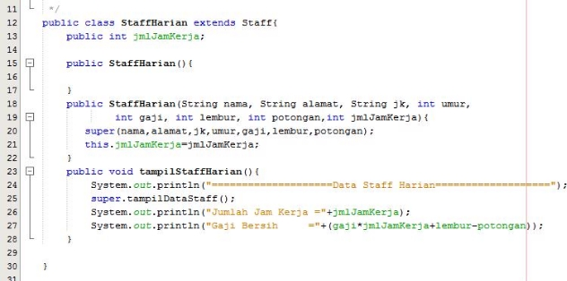
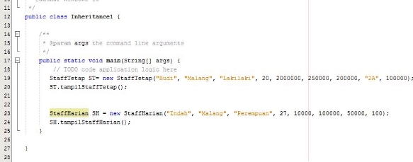
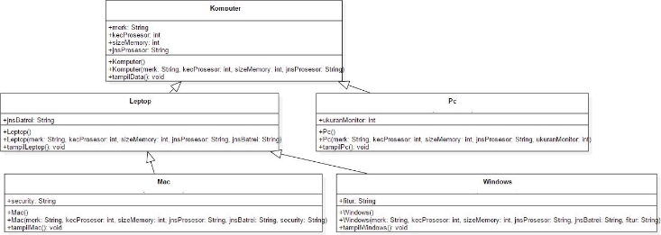
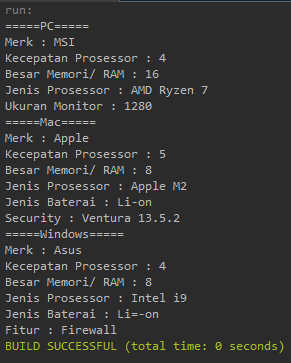

# **JOBSHEET 6** 

**INHERITANCE (PEWARISAN)**

Nama : Muhammad Kemal Nugraha<br>
Kelas/ Absen : 2C/ 17<br>
NIM : 2241720044

**1. KOMPETENSI** 

1. Memahami konsep dasar inheritance atau pewarisan.
1. Mampu memahami jenis-jenis inheritance.
1. Mampu mengimplementasikan konsep inheritance pada Bahasa pemrograman Java

**2. PENDAHULUAN** 

**Inheritance** atau **pewarisan sifat** merupakan suatu cara untuk menurunkan suatu class yang lebih umum menjadi suatu class yang lebih spesifik. Inheritance adalah salah satu ciri utama suatu bahasa program yang berorientasi pada objek. Inti dari pewarisan adalah sifat reusable dari konsep object  oriented.  Setiap  **subclass**  akan  “mewarisi”  sifat  dari  **superclass**  selama  bersifat  protected ataupun public.

Dalam  inheritance  terdapat  dua  istilah  yang  sering  digunakan.  Kelas  yang  menurunkan disebut kelas dasar (**base class**/**super class**), sedangkan kelas yang diturunkan disebut kelas turunan (**derived  class**/**sub  class**/**child  class**)  .  Di  dalam  Java  untuk  mendeklarasikan  suatu  class  sebagai subclass  dilakukan  dengan  cara  menambahkan  kata  kunci  **extends**  setelah  deklarasi  nama  class, kemudian diikuti dengan nama parent class-­­nya. Kata kunci extends tersebut memberitahu kompiler Java bahwa kita ingin melakukan perluasan class. Berikut adalah contoh deklarasi inheritance.

public class B extends A {

...

} 

Contoh  diatas  memberitahukan  kompiler  Java  bahwa  kita  ingin  meng- ­extend  class  A  ke  class  B. 

Dengan kata lain, class B adalah subclass (class turunan) dari class A, sedangkan class A adalah parent class dari class B.

Karakteristik  pada  super  class  akan  dimiliki  juga  oleh  subclassnya.  Terdapat  5  bentuk pewarisan:  single  inheritance,  multilevel  inheritance,  hierarchical  inheritance,  hybrid  inheritance, dan multiple inheritance. 

1. Single Inheritance

Single inheritance adalah Suatu class yang hanya mempunyai satu parent class. Contoh: 


Gambar 1. Contoh Single Inheritance

Berdasarkan Gambar 1 dapat diketahui bahwa class B merupakan subclass yang mempunyai satu parent yaitu class A sehingga disebut single inheritance.

2. Multilevel Inheritance

Multilevel inheritance adalah Suatu subclass bisa menjadi superclass bagi class yang lain. Contoh:


Gambar 2. Contoh Multilevel Inheritance

Berdasarkan Gambar 2 diatas dapat dilihat bahwa clas s B merupakan subclass dari class A, sehingga dalam hal ini class A adalah superclass dan class B adalah subclass. Kemudian class B yang awalmya merupakan subclass mempunyai subclass lagi yaitu class C sehingga class B menjadi superclass dari class C, begitu juga seterunya jika class C memilki subclass lagi. 

3. Hierarchical Inheritance

Hierarchical inheritance merupakan contoh pewarisan yang terjadi ketika sebuah kelas memiliki lebih dari satu kelas turunan (*subclass*) atau dengan kata lain, lebih dari  satu kelas turunan memiliki kelas induk yang sama. Konsep ini sesuai dengan contoh di dunia nyata, dimana satu orangtua bisa memiliki lebih dari satu anak. Contoh bentul hierarchical inheritance dapat dilihat pada Gambar 3. 


Gambar 3. Contoh Hierarchical Inheritance 

Pada Gambar 3 dapat dilihat bahwa class A memiliki 3 subclass, yaitu class B, class C, dan class D. Dengan demikian, class B, class C, dan class D memiliki superclass yang sama, dan ada kemungkinan ketiga class cubclass tersebut memiliki atribut dan behaviour yang sama dari class A. 

4. Hybrid Inheritance

Hybrid inheritance merupakan jenis pewarisan yang merupakan kombinasi dari dua atau lebih jenis pewarisan. Contoh hybrid inheritance dapat dilihat pada Gambar 4. 


Gambar 4. Contoh Hybrid Inheritance 

Pada Gambar 4 dapat dilihat bahwa bentuk pewarisan tersebut merupakan kombinasi dari hierarchical dan multilevel inheritance. Hierarchical inheritance ditunjukkan oleh Class A, class B, dan class C. Sedangkan multilevel inheritance ditunjukkan oleh class B, class D, dan class E. 

Terdapat beberapa aturan pada pewarisan menggunakan Bahasa pemrograman Java, antara lain: 

1. Multiple inheritance tidak dapat digunakan pada Bahasa pemrograman Java. Multiple inheritance mengacu pada proses dimana satu kelas turunan mencoba untuk memperluas (extend) lebih dari satu kelas induk. Contoh multiple inheritance dapat dilihat pada Gambar 5.  


Gambar 5. Contoh multiple inheritance 

Misal terdapat method show() pada kelas B dan C dengan fungsi yang berbeda. Kemudian kelas D meng-extend kelas B dan C. Ketika objek dari kelas D mencoba memanggil method show(), kompilator akan bingung method di kelas mana yang akan dieksekusi (dari kelas B atau C). Sehingga hal ini mengarah pada ambiguitas. 

2. Cyclic inheritance tidak dapat digunakan di Java. Cyclic inheritance merupakan jenis inheritance dimana sebuah kelas memperluas (extend) dirinya sendiri. Jenis ini tidak diizinkan oleh Java karena tidak ada peluang untuk memperluas kelas Object. 
2. Atribut dan method dengan access modifier Private tidak diwariskan. 
4. Constructor tidak dapat diwariskan. Jika ingin menggunakan constructor kelas induk, harus menggunakan perintah super() pada constructor kelas anak. 

Pada class diagram, pewarisan digambarkan dengan sebuah garis tegas, dengan segitiga di ujungnya.  Class  yang  dekat  pada  segitiga  merupakan  superclass,  sedangkan  class  yang  jauh  dari segitiga  merupakan  subclass.  Untuk  membentuk  sebuah  subclass,  keyword  “extends”  digunakan (lihat  contoh  pada  sesi  “Implementasi  Pewarisan”).  Berikut  ini  adalah  contoh  class  diagram  dari pewarisan:


Gambar 6 Contoh class diagram dalam inheritance

## PERCOBAAN 1  

1. **TAHAPAN PERCOBAAN** 

Perhatikan diagram class dibawah ini:



1. Buatlah class Karyawan



2. Buatlah class Manager


3. Buatlah class Staff



4. Buatlah class inheritance1



5. Jalankan program, maka tampilanya adalah sebagai berikut:


## PERTANYAAN
1. Sebutkan class mana yang termasuk super class dan sub class dari percobaan 1 diatas! 
<br>
Jawab: <br>
- Super Class : Class Karyawan
- Sub Class : Class Manager dan Class Staff

2. Kata kunci apakah yang digunakan untuk menurunkan suatu class ke class yang lain? 
<br>
Jawab: <br>
Keyword extends dengan formar classChild extends classParent.

2. Perhatikan kode program pada class Manager, atribut apa saja yang dimiliki oleh class tersebut? Sebutkan atribut mana saja yang diwarisi dari class Karyawan! 
<br>
Jawab: <br>
Yang dimiliki atribut manager adalah semua atribut class karyawan dan atribut tunjangan.

2. Jelaskan kata kunci super pada potongan program dibawah ini yang terdapat pada class Manager!
<br>
Jawab: <br>
Kata kunci super diperuntukkan untuk mengakses atribut gaji dari superclass nya/ class karyawan.

5. Program pada percobaan 1 diatas termasuk dalam jenis inheritance apa? Jelaskan alasannya!
<br>
Jawab: <br>
Itu termasuk dalam jenis inheritance hierarchical, karena sebuah class memiliki subclass lebih dari satu.

## PERCOBAAN 2

1. **TAHAPAN PERCOBAAN**

Perhatikan digram class dibawah ini



- Berdasarkan program yang sudah anda buat pada percobaan 1 sebelumnya tambahkan dua class yaitu class StaffTetap dan class StaffHarian. Kode Programnya adalah sebagai berikut

Class StaffTetap.java



Class StaffHarian.java



- Setelah membuat dua class diatas kemudian edit class inheritance1.java menjadi sebagai berikut:



- Jalankan program maka tampilanny adalah sebagai berikut:


## PERTANYAAN
- Berdasarkan class diatas manakah yang termasuk single inheritance dan mana yang termasuk multilevel inheritance? 
<br>
Jawab: <br>
-> single inheritance : manager ke karyawan<br>
-> multilevel inheritance : stafftetap ke staff ke karyawan, staffharian ke staff ke karyawan

- Perhatikan kode program class StaffTetap dan StaffHarian, atribut apa saja yang dimiliki oleh class tersebut? Sebutkan atribut mana saja yang diwarisi dari class Staff!
<br>
Jawab: <br>
-> staffTetap : semua atribut dari class staff dan class karyawan serta atribut golongan dan asuransi<br>
-> staffHarian : semua atribut dari class staff dan class karyawan serta atribut jmlJamKerja<br>
-> atribut yang diwarisi class staff adalah semua atribut karyawan.

- Apakah fungsi potongan program berikut pada class StaffHarian

<br>
Jawab: <br>
kode tersebut untuk memanggil konstruktor dari superClass nya.

- Apakah fungsi potongan program berikut pada class StaffHarian
<br>
Jawab: <br>
kode tersebut digunakan untuk memanggil method yang berasal dari superClass nya.

- Perhatikan kode program dibawah ini yang terdapat pada class StaffTetap

Terlihat dipotongan program diatas atribut gaji, lembur dan potongan dapat diakses langsung. Kenapa hal ini bisa terjadi dan bagaimana class StaffTetap memiliki atribut gaji, lembur, dan potongan padahal dalam class tersebut tidak dideklarasikan atribut gaji, lembur, dan potongan?
<br>
Jawab: <br>
Ternyata apabila sudah masuk dalam inheritance, bisa langsung disebutkan saja atributnya tanpa harus ada kata kunci super setiap atributnya. Dan disini class staffHarian menjadi subClass dari Staff.

## TUGAS

1\.  Buatlah sebuah program dengan konsep pewarisan seperti pada class diagram berikut ini. Kemudian buatlah instansiasi objek untuk menampilkan data pada class Mac, Windows dan Pc!.


<br>
Kode: 
- class Komputer
```java
package tugas;

public class Komputer {
    public String merk, jnsProsessor;
    public int kecProsessor, sizeMemory;

    public Komputer() {
    }

    public Komputer(String merk, String jnsProsessor, int kecProsessor, int sizeMemory) {
        this.merk = merk;
        this.jnsProsessor = jnsProsessor;
        this.kecProsessor = kecProsessor;
        this.sizeMemory = sizeMemory;
    }
    
    public void tampilData(){
        System.out.println("Merk : "+merk);
        System.out.println("Kecepatan Prosessor : "+kecProsessor);
        System.out.println("Besar Memori/ RAM : "+sizeMemory);
        System.out.println("Jenis Prosessor : "+jnsProsessor);
    }
}
```
- class Pc
```java
package tugas;

public class Pc extends Komputer{
    public int ukuranMonitor;

    public Pc() {
    }

    public Pc(int ukuranMonitor, String merk, String jnsProsessor, int kecProsessor, int sizeMemory) {
        super(merk, jnsProsessor, kecProsessor, sizeMemory);
        this.ukuranMonitor = ukuranMonitor;
    }
    
    public void tampilPc(){
        System.out.println("=====PC=====");
        super.tampilData();
        System.out.println("Ukuran Monitor : "+ukuranMonitor);
    }
}
```
-class Laptop
```java
package tugas;

public class Laptop extends Komputer{
    public String jnsBatrei;

    public Laptop() {
    }

    public Laptop(String jnsBatrei, String merk, String jnsProsessor, int kecProsessor, int sizeMemory) {
        super(merk, jnsProsessor, kecProsessor, sizeMemory);
        this.jnsBatrei = jnsBatrei;
    }
    
    public void tampilLaptop(){
        super.tampilData();
        System.out.println("Jenis Baterai : "+jnsBatrei);
    }
}
```
- class Mac
```java
package tugas;

public class Mac extends Laptop{
    public String security;

    public Mac() {
    }

    public Mac(String security, String jnsBatrei, String merk, String jnsProsessor, int kecProsessor, int sizeMemory) {
        super(jnsBatrei, merk, jnsProsessor, kecProsessor, sizeMemory);
        this.security = security;
    }
    
    public void tampilMac(){
        System.out.println("=====Mac=====");
        super.tampilLaptop();
        System.out.println("Security : "+security);
    }
}
```
- class Windows
```java
package tugas;

public class Windows extends Laptop{
    public String fitur;

    public Windows() {
    }

    public Windows(String fitur, String jnsBatrei, String merk, String jnsProsessor, int kecProsessor, int sizeMemory) {
        super(jnsBatrei, merk, jnsProsessor, kecProsessor, sizeMemory);
        this.fitur = fitur;
    }
    
    public void tampilWindows(){
        System.out.println("=====Windows=====");
        super.tampilLaptop();
        System.out.println("Fitur : "+fitur);
    }
}
```
- class MainKomputer
```java
package tugas;

public class MainKomputer {
    public static void main(String[] args) {
       Pc pc1 = new Pc(1280, "MSI", "AMD Ryzen 7", 4, 16);
       pc1.tampilPc();
       
       Mac mac1 = new Mac("Ventura 13.5.2", "Li-on", "Apple", "Apple M2", 5, 8);
       mac1.tampilMac();
       
       Windows w1 = new Windows("Firewall", "Li=-on", "Asus", "Intel i9", 4, 8);
       w1.tampilWindows();
    }
}
```
Hasil:<br>

