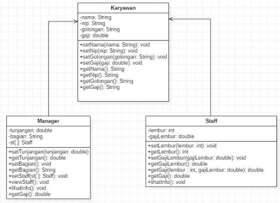
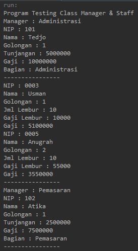
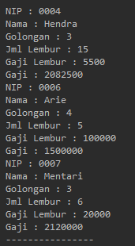
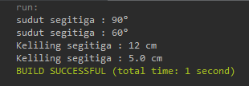
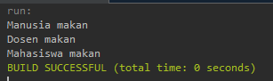

# **JOBSHEET 9 OVERLOADING DAN OVERRIDING** 

**Nama : Muhammad Kemal Nugraha**<br>
**Kelas/ Absen : 2C/ 17**<br>
**NIM : 2241720044**<br>

##  **Kompetensi** 

Setelah menempuh pokok bahasan ini, mahasiswa mampu : 

1. Memahami konsep overloading dan overriding, 
1. Memahami perbedaan overloading dan overriding, 
1. Ketepatan dalam mengidentifikasi method overriding dan overloading 
1. Ketepatan dalam mempraktekkan instruksi pada jobsheet 
1. Mengimplementasikan method overloading dan overriding. 

## **Pendahuluan** 
1. **Overloading**  

adalah menuliskan kembali method dengan nama yang sama pada suatu class. Tujuannya dapat memudahkan penggunaan/pemanggilan method dengan fungsionalitas yang mirip. Untuk aturan pendeklarasian method Overloading sebagai berikut: 

- Nama method harus sama. 

- Daftar parameter harus berbeda. 

- Return type boleh sama, juga boleh berbeda. 

Ada beberapa daftar parameter pada overloading dapat dilihat sebagai berikut: 

- Perbedaan  daftar  parameter  bukan  hanya  terjadi  pada  perbedaan  banyaknya parameter, tetapi juga urutan darai parameter tersebut. 

- Misalnya saja dua buah parameter berikut ini: 
  - Function\_member (int x, string n) 
  - Function\_member (String n, int x) 

- Dua parameter tersebut juga di anggap berbeda daftar parameternya.

- Daftar  parameter  tidak  terkait  dengan  penamaan  variabel  yang  ada  dalam parameter. 

- Misalnya saja 2 daftar parameter berikut : 

  - function\_member(int x) 
  - function\_member(int y) 

- Dua daftar parameter diatas dianggap sama karena yang berbeda hanya penamaan variable parameternya saja. 

Overloading juga bisa terjadi antara parent class dengan subclass-nya jika memenuhi ketiga syarat overload. Ada beberapa aturan overloading yaitu: 

- Primitive  widening  conversion  didahulukan  dalam  overloading  dibandingkan boxing dan var args.  

- Kita tidak dapat melakukan proses widening dari tipe wrapper ke tipe wrapper lainnya (mengubah Integer ke Long). 

- Kita tidak dapat melakukan proses widening dilanjutkan boxing (dari int menjadi Long) 

- Kita dapat melakukan boxing dilanjutkan dengan  widening (int dapat menjadi Object melalui Integer) 

- Kita dapat menggabungkan var args dengan salah satu yaitu widening atau boxing 

2. **Overriding**  

adalah Subclass yang berusaha memodifkasi tingkah laku yang diwarisi dari superclass. Tujuannya  subclass  dapat  memiliki  tingkah  laku  yang  lebih  spesifik  sehingga  dapat dilakukan dengan cara mendeklarasikan kembali method milik parent class di subclass. Deklarasi method pada subclass harus sama dengan yang terdapat di super class. Kesamaan pada: 

- Nama 

- Return type (untuk return type : class A atau merupakan subclass dari class A) 
- Daftar parameter (jumlah, tipe dan urutan) 

Sehingga method pada parent class disebut overridden method dan method pada subclass disebut overriding method. Ada beberapa aturan method didalam overriding: 

- Mode akses overriding method harus sama atau lebih luas dari pada overridden method. 

- Subclass hanya boleh meng-override method superclass satu kali saja, tidak boleh ada lebih dari satu method pada kelas yang sama persis. 

- Overriding method tidak boleh throw checked exceptions yang tidak dideklarasikan oleh overridden method. 

## **Praktikum** 
1. **Percobaan 1** 

Untuk kasus contoh berikut ini, terdapat tiga kelas, yaitu Karyawan, Manager, dan Staff. 

Class Karyawan merupakan superclass dari Manager dan Staff dimana subclass Manager dan Staff memiliki method untuk menghitung gaji yang berbeda. 



2. **Karyawan** 


3. **Staff** 


4. **Manager** 


5. **Utama** 


## HASIL PERCOBAAN
<br>


 ## **Latihan**  


1. Dari source coding diatas terletak dimanakah overloading? <br>
jawab : <br>
Terletak pada bagian kode dibawah ini, dengan adanya 2 function nama yang sama dengan parameter berbeda.
```java
void perkalian(int a, int b){
        System.out.println(a * b);
    }
void perkalian(int a, int b, int c){
        System.out.println(a * b * c);
    }
```

2. Jika terdapat overloading ada berapa jumlah parameter yang berbeda? 
 <br>
jawab : <br>
Dari source code diatas terdapat 2 function yang memiliki 2 parameter yang berbeda.

3. Dari source coding diatas terletak dimanakah overloading? <br>
jawab : <br>
Pada potongan source code dibawah ini,
```java
void perkalian(int a, int b){
        System.out.println(a * b);
    }
void perkalian(double a, double b){
        System.out.println(a * b);
    }
```

4. Jika terdapat overloading ada berapa tipe parameter yang berbeda? 
 <br>
jawab : <br>
Pada source code diatas tidak terdapat overloading karena parameter dari kedua fungsi dengan nama yang sama masih sama.

5. Dari source coding diatas terletak dimanakah overriding? <br>
jawab : <br>
Overriding terletak pada kode dibawah ini,
```java
class Ikan{
    public void swim(){
        System.out.println("Ikan bisa berenang");
    }
}
class Piranha extends Ikan {
    public void swim(){
        System.out.println("Piranha bisa makan daging");
    }
}
```

6. Jabarkanlah apabila sourcoding diatas jika terdapat overriding? <br>
jawab : <br>
Source code diatas memiliki overriding pada function swim untuk kedua class baik parent maupun child. Pada class ikan maupun piranha function swim memiliki nama yang sama (swim), tipe data yang sama (void) dan parameter yang sama (kosong) yang mengartikan bahwa function swim pada class piranha melakukan overriding pada function swim class ikan.

## **Tugas** 
1. **Overloading** 

Implementasikan konsep overloading pada class diagram dibawah ini : 

 <br>
jawab : <br>
code 
```java
package Tugas.overloading;

import java.util.*;
public class Segitiga {
    private int sudut;
    
    public void setSudut(int sudut){
        this.sudut=sudut;
    }
    public int getSudut(){
        return sudut;
    }
    
    public int totalSudut(int sudutA){
        return 180 - sudutA;
    }
    public int totalSudut(int sudutA, int sudutB){
        return 180 - (sudutA + sudutB);
    }
    public int keliling(int sisiA, int sisiB, int sisiC){
        return sisiA + sisiB + sisiC;
    }
    public double keliling(int sisiA, int sisiB){
        return Math.sqrt(sisiA * sisiA + sisiB * sisiB);
    }
    
    public static void main(String[] args) {
        Segitiga sgt = new Segitiga();
        sgt.setSudut(sgt.totalSudut(90));
        System.out.println("sudut segitiga : "+sgt.sudut+"°");
        sgt.setSudut(sgt.totalSudut(90, 30));
        System.out.println("sudut segitiga : "+sgt.sudut+"°");
        System.out.println("Keliling segitiga : "+sgt.keliling(3, 4, 5)+" cm");
        System.out.println("Keliling segitiga : "+sgt.keliling(3, 4)+" cm");
    }
}
```
hasil running  <br>


2. **Overriding** 

Implementasikan  class  diagram  dibawah  ini  dengan  menggunakan  teknik  dynamic method dispatch : 

<br>
jawab :<br>
code 
```java
package Tugas.overriding;

public class Manusia {
    
    public void bernafas(){
        System.out.println("Manusia bernafas");
    }
    public void makan(){
        System.out.println("Manusia makan");
    }
    
    public static void main(String[] args) {
        Manusia man = new Manusia();
        Manusia dos = new Dosen();
        Manusia mhs = new Mahasiswa();
        
        man.makan();
        dos.makan();
        mhs.makan();
    }
}
class Dosen extends Manusia{
    
    public void makan(){
        System.out.println("Dosen makan");
    }
    public void lembut(){
        System.out.println("Dosen lembur");
    }
}

class Mahasiswa extends Manusia{
    
    public void makan(){
        System.out.println("Mahasiswa makan");
    }
    public void tidur(){
        System.out.println("Mahasiswa tidur");
    }
}
``` 
hasil running <br>



