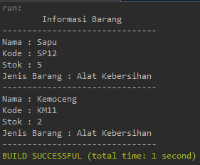

# Quiz 1 - OOP
Nama : Muhammad Kemal Nugraha <br>
Kelas : 2C <br>
NIM : 2241720044 <hr>

1. Class dan Object: 
- Apa yang dimaksud dengan "class" dalam pemrograman berorientasi objek? <br>
jawab:<br>
Class adalah sebuah tempat dari objek yang akan dibuat. Biasanya berisi atribut dan method objeknya.
<br><br>
- Bagaimana Anda mendefinisikan objek dari suatu class dalam bahasa pemrograman Java? <br>
jawab:<br>
Untuk mendifinisikan objek perlu dibuat atribut dan juga method didalamnya, lalu dilakukan istansiasi objek.
<br><br>
- Misalkan Anda memiliki class "Barang" dalam sistem informasi inventaris. Bagaimana Anda akan membuat objek "laptop" dari class tersebut? <br>
jawab:<br>
Pertama-tama harus membuat classs barang, setelah itu dilakukan instansiasi,
```
Barang Laptop = new Barang();
```
<br>

2. Encapsulation: 
- Jelaskan konsep encapsulation dalam pemrograman berorientasi objek dan mengapa hal ini penting dalam pengembangan sistem informasi inventaris barang. <br>
jawab:<br>
Enkapsulasi adalah proses pemberian hak akses dengan modifier pada sebuah atribut maupun method dari sebuah class dengan tujuan agar tidak diubah secara bebas.<br>
Dalam pengembangan sistem informasi inventaris barang, enkapsulasi berguna agar atribut ataupun methodnya tidak disalah gunakan oleh user bila bermodifier public oleh karena itu digunakanlah modifier private atau protected. 
<br><br>
- Dalam konteks sistem informasi inventaris, sebutkan contoh atribut (variabel) yang harus di-encapsulate dan mengapa. <br>
jawab:<br>
Tanggal dibeli : tidak mungkin tanggal dibelinya suatu barang dapat berubah. <br>
kodeBarang : setiap kode barang itu unik dan tidak sama, maka perlu dijaga konsistensi datanya dengan enkapsulasi.<br>
kondisi : kondisi barang memang dapat berubah, tapi hanya oleh beberapa orang seperti penjaga barang/ ob.<br>
lokasi : lokasi adalah tempat yang paling sensitif, karena bila sembarang diubah dan ternyata salah maka akan sulit mencari lokasi barang itu berada.
<br><br>

3. Relasi Kelas: 
- Apa yang dimaksud dengan relasi antara kelas dalam pemrograman berorientasi objek? <br>
jawab:<br>
Relasi class merupakan sebuah interaksi antara class-class yang ada dengan tujuan tertentu. Semisal class mahasiswa dan class mataKuliah, kedua class ini mempunyai relasi yaitu mahasiswa mengambil mata kuliah.
<br><br>
- Dalam sistem informasi inventaris barang, bagaimana Anda akan menggambarkan relasi antara kelas "Barang" dan kelas "Kategori"? <br>
jawab:<br>
class Barang dan class Kategori memiliki relasi dimana setiap dari Barang memiliki kategori tertentu. Misalnya ada objek seperti Komputer dan Printer, kedua objek Barang ini masuk ke kategori Elektronik.
<br><br>

4. PBL: 
- Berdasarkan kasus sistem informasi inventaris barang, coba buat sebuah class sederhana beserta atribut dan metodenya yang menggambarkan suatu entitas dalam sistem tersebut (misalnya, class "Barang"). <br>
code :
```java
package sisteminventaris;

public class Barang {
    private String namaBarang;
    private String kodeBarang;
    private int stok;

    public Barang(String namaBarang, String kodeBarang, int stok) {
        this.namaBarang = namaBarang;
        this.kodeBarang = kodeBarang;
        this.stok = stok;
    }
    public void setNama(String newNama){
        namaBarang = newNama;
    }
    public String getNama(){
        return namaBarang;
    }
    public void setKode(String newKode){
        kodeBarang = newKode;
    }
    public String getKode(){
        return kodeBarang;
    }
    public void setStok(int newStok){
        stok = newStok;
    }
    public int getStok(){
        return stok;
    }
}
```
<br>

- Bagaimana Anda akan menggunakan encapsulation untuk melindungi atribut-atribut dalam class tersebut? <br>
jawab : <br>
kode dibawah ini adalah sebuah enkapsulasi yang bermodifier private agar atributnya terlindungi.
```java
    private String namaBarang;
    private String kodeBarang;
    private int stok;
```
<br>

- Gambarkan hierarki class atau hubungan antar class yang mungkin ada dalam sistem informasi inventaris barang di jurusan Teknologi Informasi. Berikan contoh relasi antar class (misalnya, inheritance atau association) dalam konteks tersebut.<br>
jawab : <br>
disini saya akan membuat relasi class antara Barang dan Alat Kebersihan yang merupakan inheritance. Dimana sebuah barang dapat memiliki Alat Kebersihan yang merupakan jenis barang itu.

- ### Class Barang
```java
package sisteminventaris;

public class Barang {
    private String namaBarang;
    private String kodeBarang;
    private int stok;

    public Barang(String namaBarang, String kodeBarang, int stok) {
        this.namaBarang = namaBarang;
        this.kodeBarang = kodeBarang;
        this.stok = stok;
    }
    public void setNama(String newNama){
        namaBarang = newNama;
    }
    public String getNama(){
        return namaBarang;
    }
    public void setKode(String newKode){
        kodeBarang = newKode;
    }
    public String getKode(){
        return kodeBarang;
    }
    public void setStok(int newStok){
        stok = newStok;
    }
    public int getStok(){
        return stok;
    }
}
```
- ### Class AlatKebersihan
```java
package sisteminventaris;

public class AlatKebersihan extends Barang{
    private String jenisBarang = "Alat Kebersihan";

    public AlatKebersihan(String namaBarang, String kodeBarang, int stok) {
        super(namaBarang, kodeBarang, stok);
    }
    
    public void infoBarang(){
        System.out.println("Nama : "+super.getNama());
        System.out.println("Kode : "+super.getKode());
        System.out.println("Stok : "+super.getStok());
        System.out.println("Jenis Barang : "+this.jenisBarang);
        System.out.println("-------------------------------");
    }
}
```
- ### Class MainInventaris
```java
package sisteminventaris;

public class MainInventaris {
    public static void main(String[] args) {
        AlatKebersihan sapu = new AlatKebersihan("Sapu", "SP12", 5);
        AlatKebersihan kemoceng = new AlatKebersihan("Kemoceng", "KM11", 2);
        System.out.println("\tInformasi Barang");
        System.out.println("-------------------------------");
        sapu.infoBarang();
        kemoceng.infoBarang();
    }
}
```
- ### Hasil
