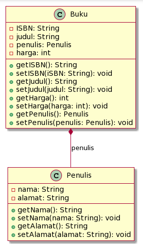

# **UJIAN TENGAH SEMESTER GENAP TAHUN AKADEMIK 2023/2024**

<hr>
<b>Identitas Diri :</b><br>
Nama  : Muhammad Kemal Nugraha<br>
Kelas : 2C<br>
NIM   : 2241720044<br>

## **Soal 1: Penulisan Class**

Berdasarkan contoh class ClassA di bawah ini, jelaskan apakah penulisan source code pada contoh class tersebut sudah benar. Jika tidak, apa yang perlu diperbaiki?

```java
public class ClassA { 
    float f1 = 0.15f;
    float hitung() {
        float x = 2f * f1; 
    }
}
```

<b>Jawab:</b> <br>
Kode tersebut masih terdapat kesalahan dimana fungsi hitung() yang bertipe float tapi tidak memiliki statement return didalamnya. 

perbaikan :
```java
public class ClassA {
public float f1 = 0.15f;
	
	public float hitung() {
		float x = 2f * f1;
		return x;
	}
}

```

## **Soal 2: Perhitungan Jumlah Elemen Array 2 Dimensi**
Pada class SoalArray1, terdapat array 2 dimensi dengan ukuran 3x3. Tuliskan code Java untuk 
menghitung jumlah total elemen array tersebut dengan menggunakan perulangan. 

```java
public class SoalArray1 {
public static void main(String[] args) {

int[][] arrayInt = {{1, 1, 4}, {2, 1, 2}, {3, 2, 1}};
// hitung jumlah elemen array 2 dimensi
// gunakan perulangan
}
}
```

<b>Jawab:</b>
- ini kode untuk menghitung banyaknya elemen
```java
public class SoalArray1 {
 	public static void main(String[] args) {
 		int[][] arrayInt = {{1, 1, 4}, {2, 1, 2}, {3, 2, 1}};
		int counter = 0;
 		for (int i = 0; i < arrayInt.length; i++) {
			for (int j = 0; j < arrayInt[i].length; j++){
				counter++;
			}
		}
		System.out.print(counter);
 	}
}
Hasil = 9
```
- dan ini kode untuk menghitung total penjumlahan elemen
```java
public class SoalArray1 {
 	public static void main(String[] args) {
 		int[][] arrayInt = {{1, 1, 4}, {2, 1, 2}, {3, 2, 1}};
		int counter = 0;
 		for (int i = 0; i < arrayInt.length; i++) {
			for (int j = 0; j < arrayInt[i].length; j++){
				counter += arrayInt[i][j] ;
			}
		}
		System.out.print(counter);
 	}
}
Hasil = 17
```

## **Soal 3: Pewarisan Atribut dan Method**

Pada source code yang diberikan, class ClassY merupakan turunan dari class Class. Sebutkan atribut dan method apa saja yang diwarisi oleh ClassY dari kelas induknya (class Class). Jelaskan juga apa output dari code yang ditulis pada class ClassY dan bagaimana nilai tersebut diperoleh.

```java
public class Class {
int a = 2;

    int x = 0;

    int hitung() {

        x = x + 5 * a; return x;

    }

}

public class ClassY extends Class {
    int b = 5;
    int y = 0;
    int hitungY() {
    y = hitung() * b;
    return y;
}

public static void main(String[] args) {
    ClassY cy = new ClassY();
    System.out.println(cy.hitungY());
    }
}

```

<b>Jawab:</b><br>
ClassY akan mewarisi atribut a dan x serta method hitung().
Output yang diperoleh berjumlah 50, pertama-tama disini akan mencari hasil dari hitungY dimana rumus nya yaitu hitung() * b. Maka yang akan dijalankan dahulu adalah method hitungY() kemudian dari rumus tersebut akan dijalankan method hitung() dari Class<br>
hitung():<br>
x = x + 5 * a<br>
x = 0 + 5 * 2<br>
x = 10<br>
Setelah itu kembali lagi ke method hitungY dimana hasil tadi akan dikalikan dengan b<br>
hitungY:<br>
y = hitung() * b<br>
y = 10 * 5<br>
y = 50<br>
Dan setelah itu Y akan diprint.


## **Soal 4: Class Mahasiswa dengan Constructor** 
Dalam class Mahasiswa, lengkapi code dengan: <br>
a. Menambahkan constructor untuk mengisi atribut nim, nama, alamat, dan jenisKelamin. <br>
b. Membuat objek mahasiswa dan mengisi atribut nim, nama, alamat, dan jenisKelamin melalui 
constructor. 

```java
public class Mahasiswa {

`    `String nim, nama, alamat; char jenisKelamin;

`    `// a. Tambahkan constructor

`    `// Gunakan constructor untuk

`    `// mengisi atribut nim, nama, alamat, jenisKelamin

`    `public static void main(String[] args) {

`        `// b. Buat objek mahasiswa

`        `// Isi atribut nim, nama, alamat, jenisKelamin // lewat constructor

`    `}

}
```

<b>Jawab:</b><br> 
```java
public class Mahasiswa {
    String nim, nama, alamat;
    char jenisKelamin;

    public Mahasiswa(String nim, String nama, String alamat, char jenisKelamin) {
        this.nim = nim;
        this.nama = nama;
        this.alamat = alamat;
        this.jenisKelamin = jenisKelamin;
    }
    
    public static void main(String[] args) {
        Mahasiswa mhs1 = new Mahasiswa("2241720044", "Kemal", "Malang", 'L');
    }
}
```
## **Soal 5: OOP Buku -> Penulis**

Perhatikan class diagaram berikut dan Buatlah Source code dalam Bahasa java berdasarkan class diagram tersebut



<b>Jawab:</b><br>
- class Buku
```java
public class Buku {
    private String ISBN;
    private String judul;
    private Penulis penulis;
    private int harga;
    
    public String getISBN(){
        return ISBN;
    }
    public void setISBN(String iSBN){
        ISBN = iSBN;
    }
    public String getJudul(){
        return judul;
    }
    public void setJudul(String Judul){
        judul = Judul;
    }
    public int getHarga(){
        return harga;
    }
    public void setHarga(int Harga){
        harga = Harga;
    }
    public Penulis getPenulis(){
        return penulis;
    }
    public void setPenuls(Penulis Penulis){
        penulis = Penulis;
    }
}

```
- class Penulis
```java
public class Penulis {
    private String nama;
    private String alamat;
    
    public String getNama(){
        return nama;
    }
    public void setNama(String Nama){
        nama = Nama;
    }
    public String getAlamat(){
        return alamat;
    }
    public void setAlamat(String Alamat){
        alamat = Alamat;
    }
}
```